# Отчёт по лабораторной работе №2  
**Тема:** RAID, LVM, NFS, cron, файрвол и сетевые сервисы  
**Среда выполнения:** VirtualBox 7.0 / Ubuntu Server 24.04 LTS  

---

## 1. Среда выполнения
- **Гипервизор:** VirtualBox 7.0
- **Образ:** Ubuntu Server 24.04 LTS (kernel 6.8)  
- **Дополнительные диски:** 3 диска по 5 ГБ (позже добавлен 4-й диск 5 ГБ)  

> *Пояснение:* RAID 5 требует минимум 3 диска. Диски добавлены через настройки SATA-контроллера ВМ.

---

## 2. Задание 1. Развёртывание ВМ с дисками  
**Цель:** показать, что к ВМ подключены дополнительные диски для RAID.  

**Выполнение:**  
В настройках VirtualBox добавлены три диска `sdb`, `sdc`, `sdd` по 5 ГБ.  

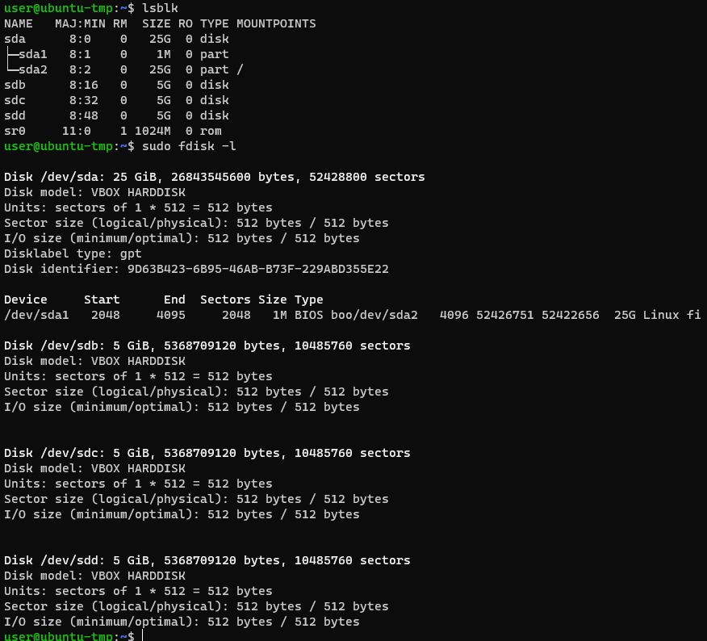
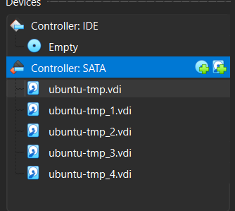

---

## 3. Задание 2. SSH по ключу  
**Цель:** обеспечить безопасный удалённый доступ без пароля.  

**Выполнение:**  
- На хосте сгенерирована пара ключей `ssh-keygen -t ed25519`.  
- Публичный ключ скопирован на ВМ: `ssh-copy-id user@192.168.1.180`.  
- В `/etc/ssh/sshd_config` отключена парольная аутентификация: `PasswordAuthentication no`.  
- Выполнен вход по SSH без пароля.  

**Скриншот:** успешный вход по SSH (приглашение без запроса пароля)

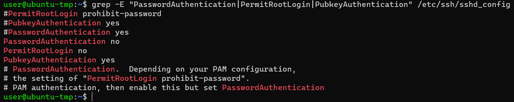
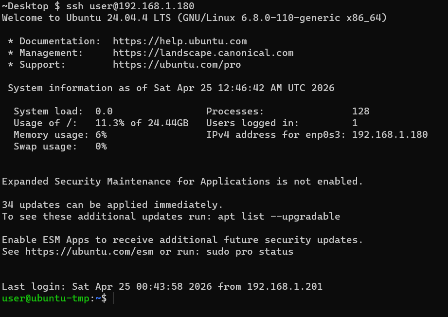


---

## 4. Задание 3. Настройка сети (netplan)  
**Цель:** задать серверу статический IP для постоянного доступа.  

**Выполнение:**  
Отредактирован файл `/etc/netplan/00-installer-config.yaml`:  
```yaml
network:
  version: 2
  renderer: networkd
  ethernets:
    enp0s3:
      dhcp4: no
      addresses: [192.168.1.180/24]
      routes:
        - to: default
          via: 192.168.1.1
      nameservers:
        addresses: [8.8.8.8, 8.8.4.4]
```
Применено `sudo netplan apply`.  

**Результаты:**  
- `ip a` → интерфейс `enp0s3` имеет статический IP 192.168.1.180  
- `ip r` → маршрут по умолчанию через 192.168.1.1  

**Скриншоты:**  
- 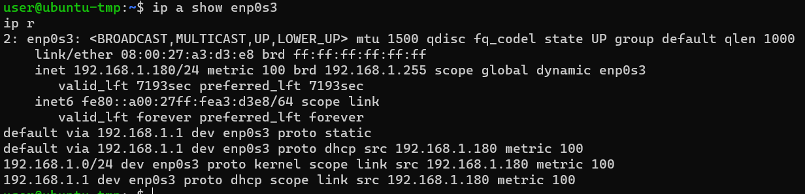
- 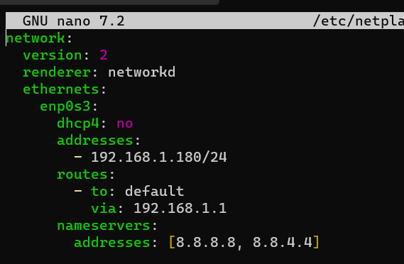

---

## 5. Задание 4. Конфигурация дисков  
**Цель:** определить свободные диски для RAID.  

**Выполнение:**  
`lsblk` и `sudo fdisk -l` показали диски: `sda` (системный), `sdb`, `sdc`, `sdd` без разделов – готовы для RAID.  

**Скриншот:**
- 

---

## 6. Задание 5. RAID 5  
**Что такое RAID 5?**  
RAID 5 распределяет данные и контрольные суммы по трём или более дискам. Обеспечивает отказоустойчивость и увеличенное полезное пространство (N-1 дисков).  

**Выполнение:**  
```bash
sudo mdadm --create /dev/md0 --level=5 --raid-devices=3 /dev/sdb /dev/sdc /dev/sdd
```
Состояние синхронизации отслеживалось через `cat /proc/mdstat`. После завершения массив активен. Конфигурация сохранена в `/etc/mdadm/mdadm.conf`.  

**Результат:** массив `/dev/md0` уровня 5 из трёх дисков.  

**Скриншоты:**  
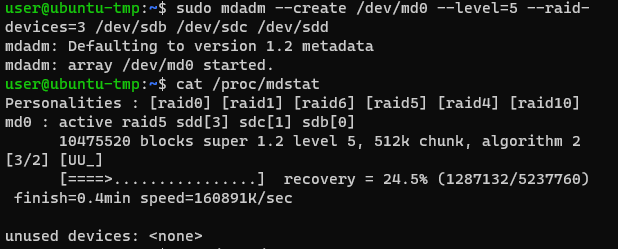


---

## 7. Задание 6. LVM и монтирование `/raid/0`  
**Что такое LVM?**  
LVM (Logical Volume Manager) позволяет гибко управлять дисковым пространством: создавать логические тома, изменять их размер без остановки системы.  

**Выполнение:**  
```bash
sudo pvcreate /dev/md0                         # физический том
sudo vgcreate frolkin /dev/md0                 # группа томов (по фамилии)
sudo lvcreate -n lv0 -l 100%FREE frolkin       # логический том
sudo mkfs.ext4 /dev/frolkin/lv0                # форматирование
sudo mkdir -p /raid/0
sudo mount /dev/frolkin/lv0 /raid/0
```
Добавлена строка в `/etc/fstab` для автоматического монтирования.  

**Проверка:** `df -h` → том размером ~10 ГБ смонтирован в `/raid/0`.  

**Скриншоты:**  


---

## 8. Задание 7. Расширение RAID и LVM  
**Цель:** продемонстрировать возможность горячего расширения хранилища.  

**Выполнение:**  
- В VirtualBox добавлен 4-й диск `/dev/sde` (5 ГБ).  
- Диск добавлен в RAID: `sudo mdadm --add /dev/md0 /dev/sde` и выполнен рост числа устройств: `sudo mdadm --grow /dev/md0 --raid-devices=4`.  
- Перестройка отслеживалась через `cat /proc/mdstat`.  
- Расширен PV: `sudo pvresize /dev/md0`, затем LV: `sudo lvextend -l +100%FREE /dev/frolkin/lv0` и файловая система: `sudo resize2fs /dev/frolkin/lv0`.  

**Результат:** размер `/raid/0` увеличился с 10 ГБ до ~15 ГБ.  

**Скриншоты:**  
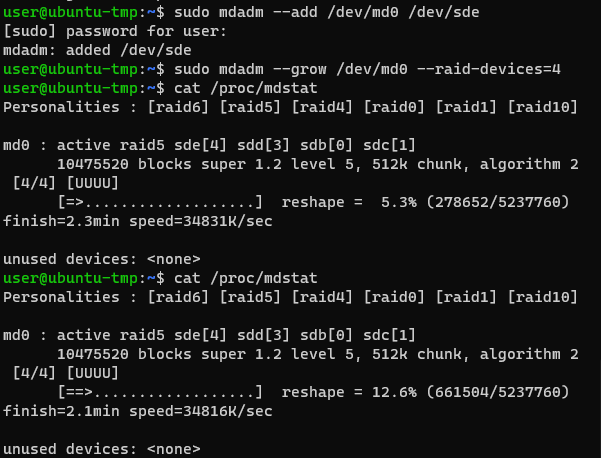
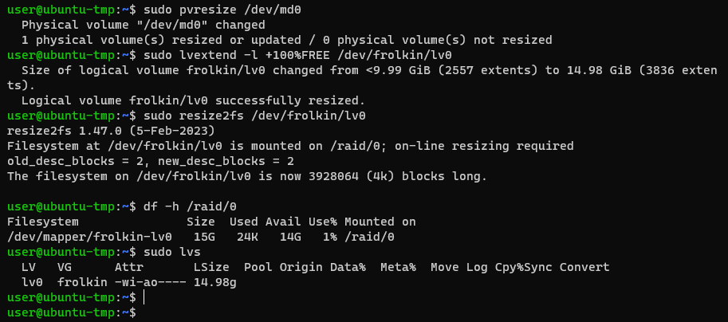

---

## 9. Задание 9. NFS  
**Что такое NFS?**  
NFS (Network File System) – протокол для удалённого доступа к файлам по сети.  

**Выполнение:**  
- Создан каталог `/raid/0/backup`.  
- Установлен nfs-kernel-server.  
- В `/etc/exports` добавлена строка: `/raid/0/backup *(rw,sync,no_subtree_check)`.  
- Экспортировано: `sudo exportfs -a`.  

**Проверка:** `showmount -e localhost` показал экспорт. Монтирование с localhost успешно.  

**Скриншоты:**  
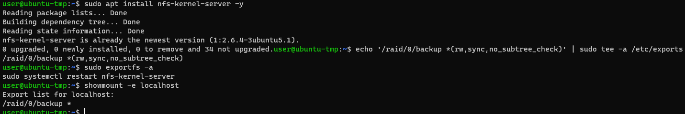
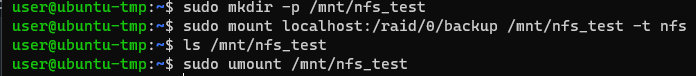
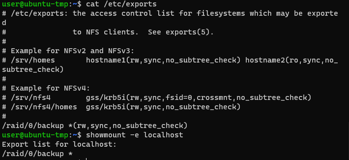

---

## 10. Задание 10. Cron и бэкап домашнего каталога  
**Что такое cron?**  
Cron – планировщик задач, выполняющий команды по расписанию.  

**Выполнение:**  
- Создан скрипт `/usr/local/bin/backup_home.sh`:  
```bash
#!/bin/bash
/bin/tar -czf "/raid/0/backup/home_backup_$(date +%Y%m%d_%H%M%S).tar.gz" /home/user
```
- Скрипту даны права на исполнение.  
- В crontab root добавлена строка: `*/2 * * * * /usr/local/bin/backup_home.sh`.  

**Результат:** каждые 2 минуты создаются архивы домашнего каталога в `/raid/0/backup/`.  

**Скриншоты:**  


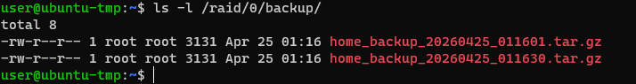

---

## 11. Часть 2. Задания 11–21  

### 11–12. iptables – создание и удаление правил  
**Что такое iptables?**  
Iptables – утилита для настройки правил фильтрации пакетов в ядре Linux.  

**Выполнение:**  
Добавлены правила:  
```bash
sudo iptables -A INPUT -p tcp --dport 22 -j DROP
sudo iptables -A INPUT -s 10.10.10.10 -j DROP
sudo iptables -A INPUT -p icmp -j DROP
```
Проверка: `sudo iptables -L -n`.  
Правила удалены командами `-D`.  

**Скриншоты:**  
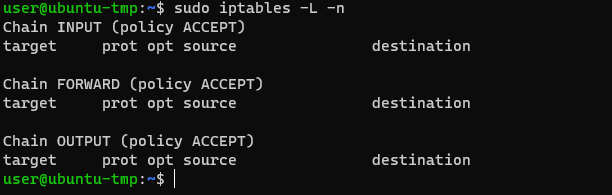

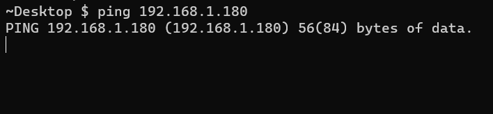
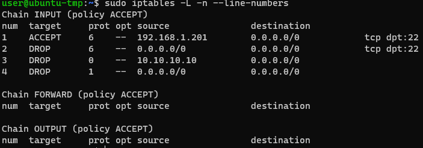
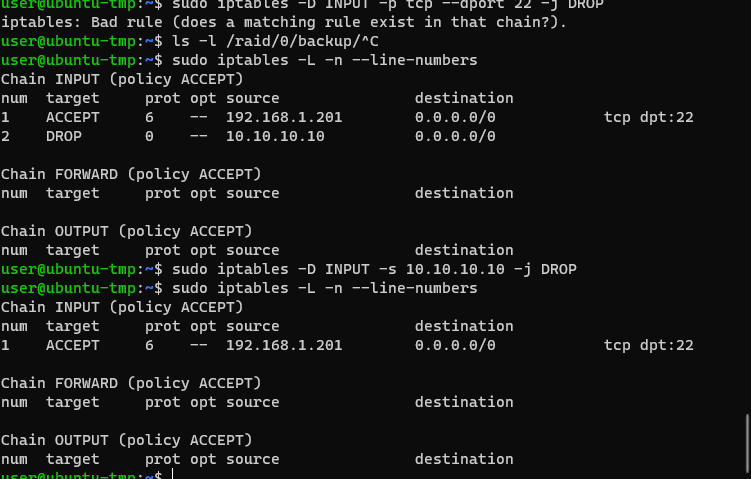
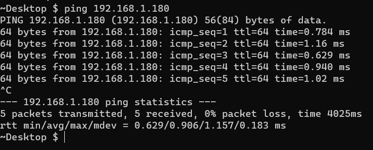

### 13. UFW с правилами блокировки  
**Что такое UFW?**  
UFW (Uncomplicated Firewall) – надстройка над iptables для простого управления файрволом.  

**Выполнение:**  
```bash
sudo ufw default deny incoming
sudo ufw enable
sudo ufw deny 22/tcp
sudo ufw deny from 10.10.10.10
sudo ufw deny proto icmp
```
Для сохранения SSH-доступа предварительно добавлено разрешение для своего IP.  
После скриншота правила удалены.  

**Скриншот:**
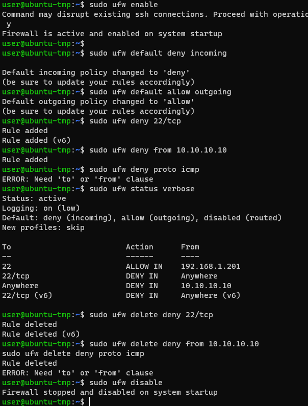


### 14. ss и nc  
**Цель:** просмотр открытых портов и проверка доступности портов.  

**Выполнение:**  
```bash
ss -tuln         # все слушающие порты
nc -zv localhost 22
```
**Скриншот:**
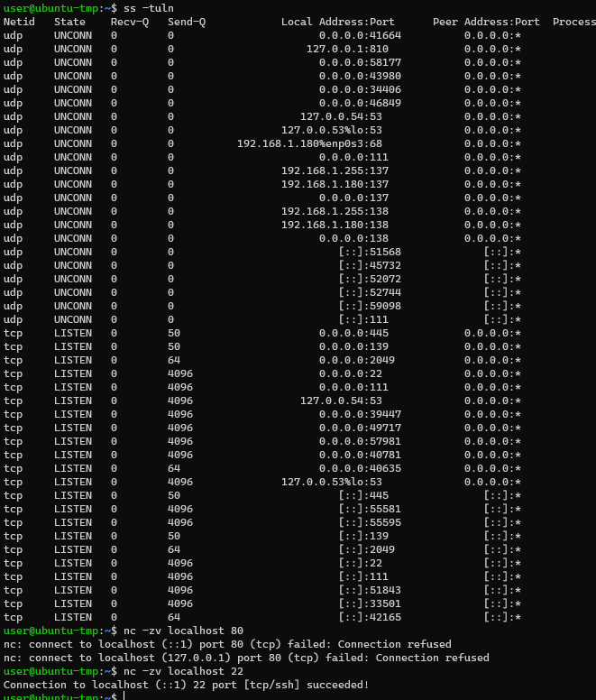


### 15. tcpdump  
**Цель:** захват и анализ трафика.  

**Выполнение:**  
```bash
sudo tcpdump -i enp0s3 icmp -c 5      # перехват ICMP-пакетов
sudo tcpdump -i enp0s3 -w capture.pcap -c 20
```
**Скриншот:**
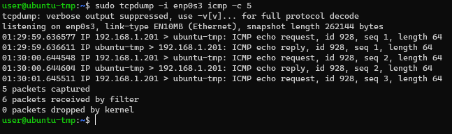
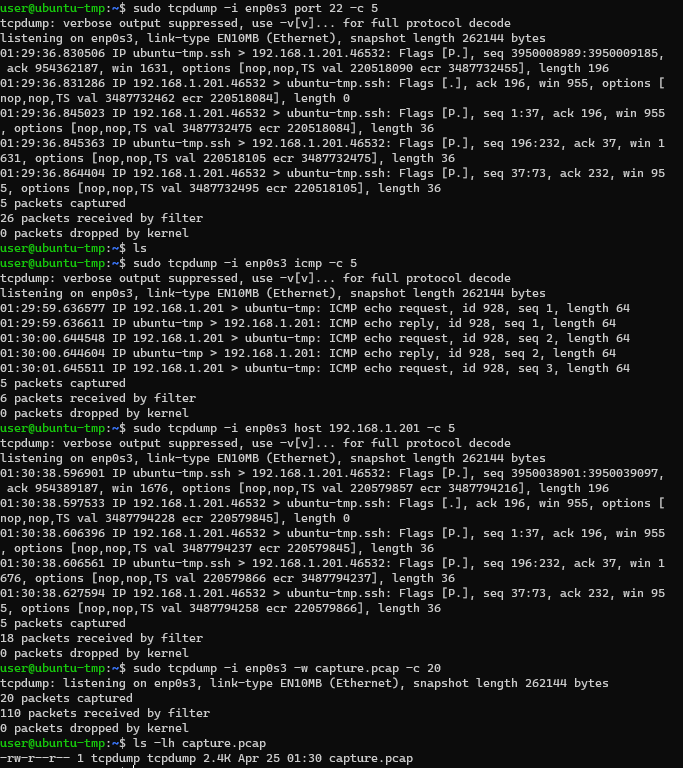


### 16. iptraf-ng  
**Цель:** мониторинг трафика в реальном времени.  

**Выполнение:**  
`sudo iptraf-ng` → выбран пункт "IP traffic monitor".  

**Скриншот:**
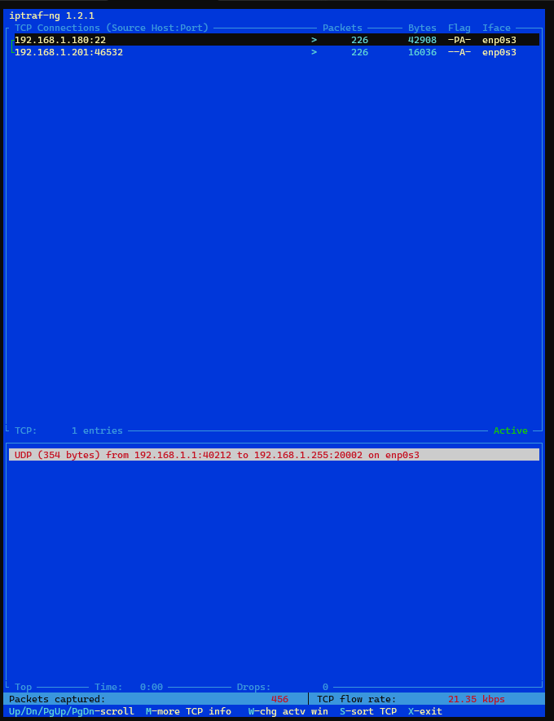

### 17. Дополнительный сетевой интерфейс 172.23.0.7/24  
**Выполнение:**  
В VirtualBox добавлен второй адаптер (Host-only). В netplan добавлен интерфейс `enp0s8` с IP 172.23.0.7/24. Применено `netplan apply`.  

**Результат:** `ip a` показывает `enp0s8` с адресом 172.23.0.7.  

**Скриншот:**
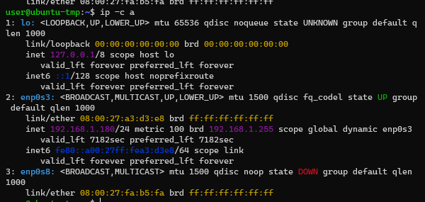
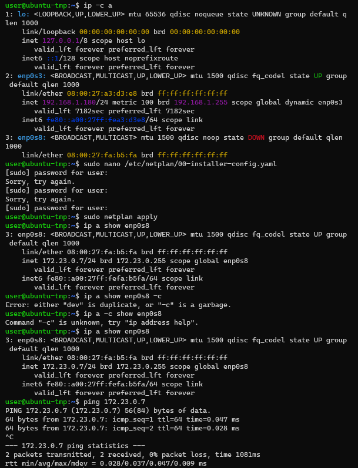

### 18. Открытие портов 139 и 445 в ufw, проверка nc  
**Выполнение:**  
```bash
sudo ufw allow 139/tcp
sudo ufw allow 445/tcp
nc -zv 172.23.0.7 139
nc -zv 172.23.0.7 445
```
Порты открыты, nc показывает "Connection refused" (сервисы не запущены).  

**Скриншот:**
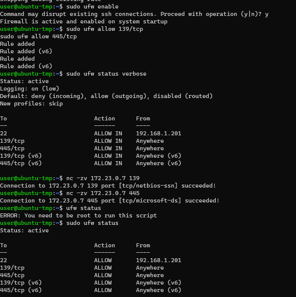

### 19. OpenVPN (сервер 10.8.0.1/24, клиентский конфиг)  
**Что такое OpenVPN?**  
Решение для создания защищённых VPN-сетей.  

**Выполнение:**  
- Установлены openvpn и easy-rsa.  
- Создана PKI, сгенерированы сертификаты CA, сервера и клиента.  
- Настроен `/etc/openvpn/server.conf` с сетью `10.8.0.0/24`.  
- Запущен сервер: `sudo systemctl start openvpn@server`.  
- Появился интерфейс `tun0` с адресом 10.8.0.1.  
- Создан клиентский конфиг `client1.ovpn` с ключами.  
- Клиент запущен в той же ВМ – соединение установлено, появился интерфейс `tun1` с адресом 10.8.0.2, пинг до 10.8.0.1 проходит.  

**Скриншоты:**  
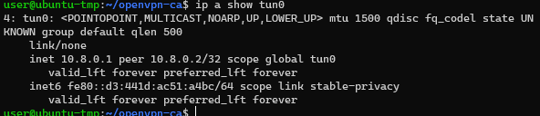
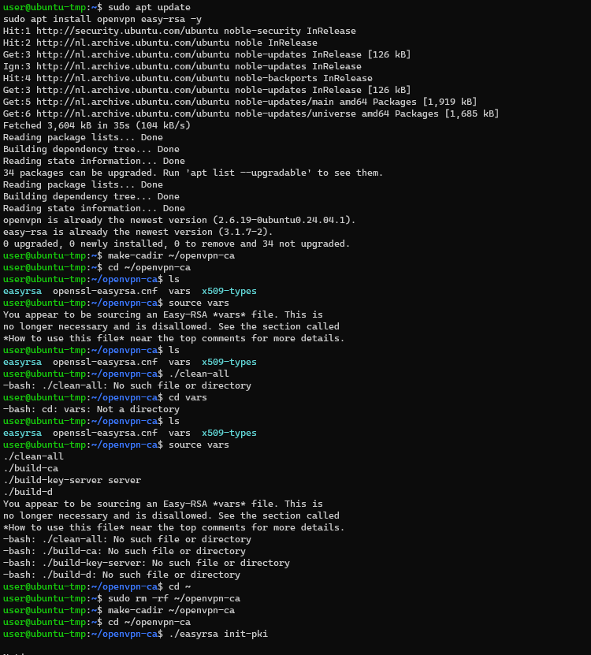
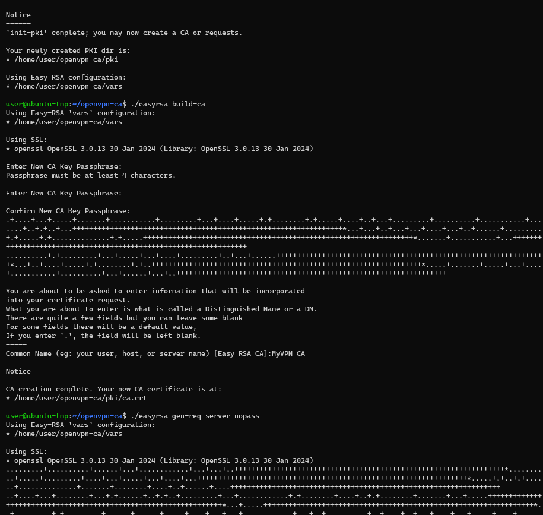
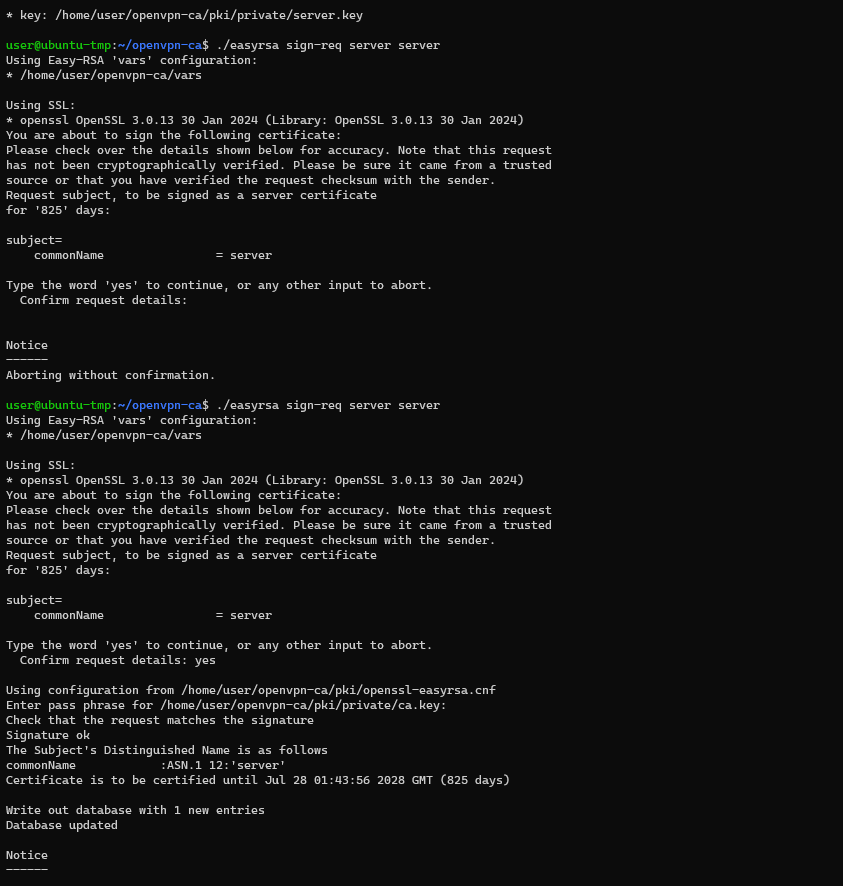
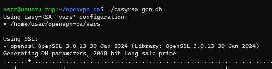
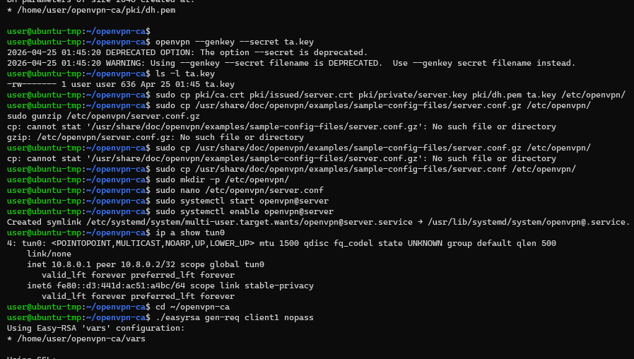
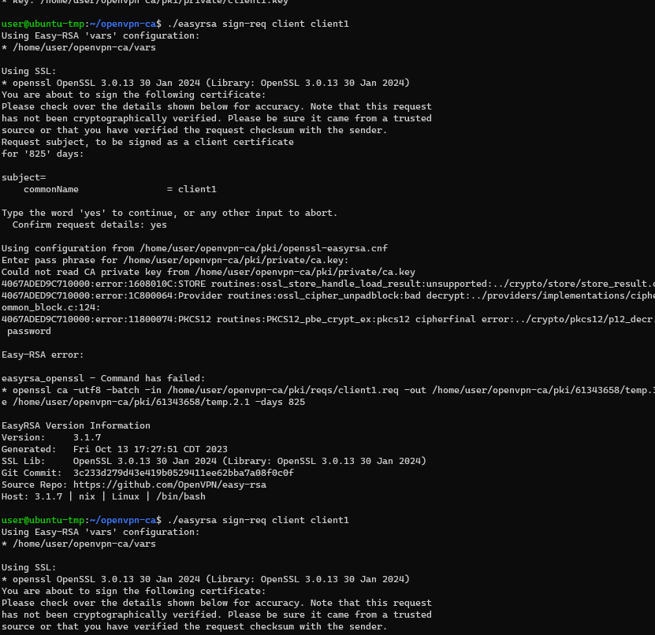
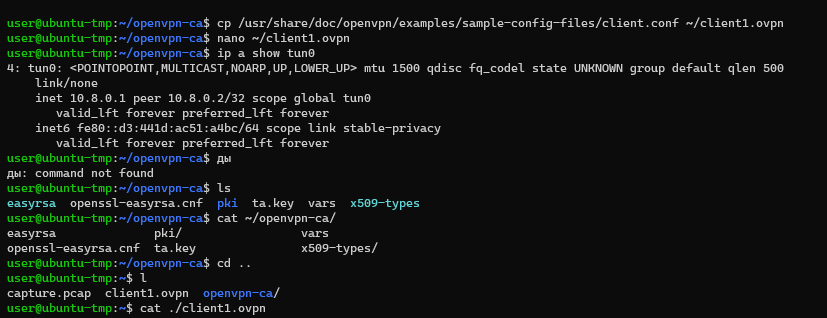
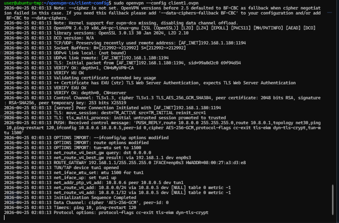
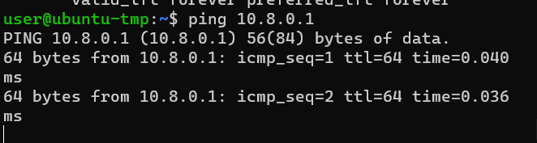


### 20. Samba (общая папка, доступ по 172.23.0.7)  
**Что такое Samba?**  
Реализация протокола SMB/CIFS для предоставления файловых ресурсов в сетях Windows/Linux.  

**Выполнение:**  
```bash
sudo apt install samba -y
sudo mkdir -p /raid/0/samba && sudo chmod 777 /raid/0/samba
```
В `/etc/samba/smb.conf` добавлена секция `[myshare]`.  
Перезапущен `smbd`.  
Проверка: `smbclient //172.23.0.7/myshare -N` – вход выполнен, создан тестовый файл.  

**Скриншоты:**  
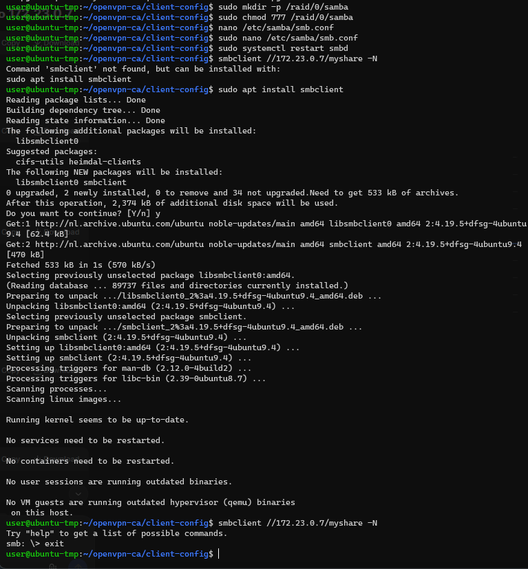
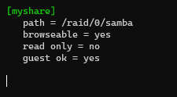
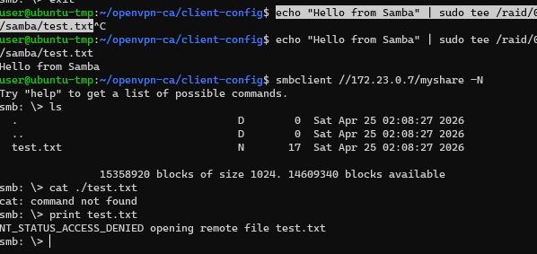

### 21. Проброс портов 139, 445 из сети 172.23.0.0/24 в VPN-сеть 10.8.0.0/24  
**Цель:** перенаправление SMB-трафика в VPN.  

**Выполнение:**  
Включён IP forwarding. Добавлены правила iptables:  
```bash
sudo iptables -t nat -A PREROUTING -i enp0s8 -p tcp --dport 139 -j DNAT --to-destination 10.8.0.2:139
sudo iptables -t nat -A PREROUTING -i enp0s8 -p tcp --dport 445 -j DNAT --to-destination 10.8.0.2:445
sudo iptables -A FORWARD -i enp0s8 -o tun0 -p tcp --dport 139 -j ACCEPT
sudo iptables -A FORWARD -i enp0s8 -o tun0 -p tcp --dport 445 -j ACCEPT
```

**Проверка:** правила видны в `iptables -t nat -L -n` и `iptables -L -n`.  

**Скриншот:**
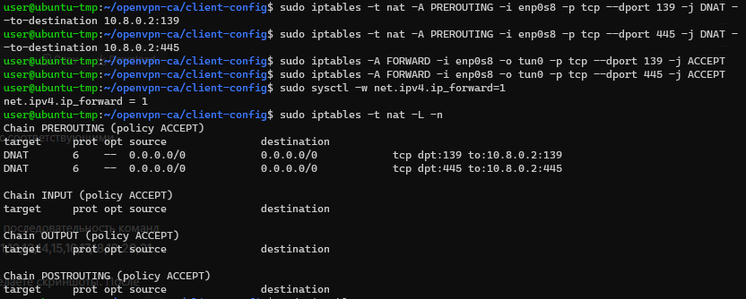
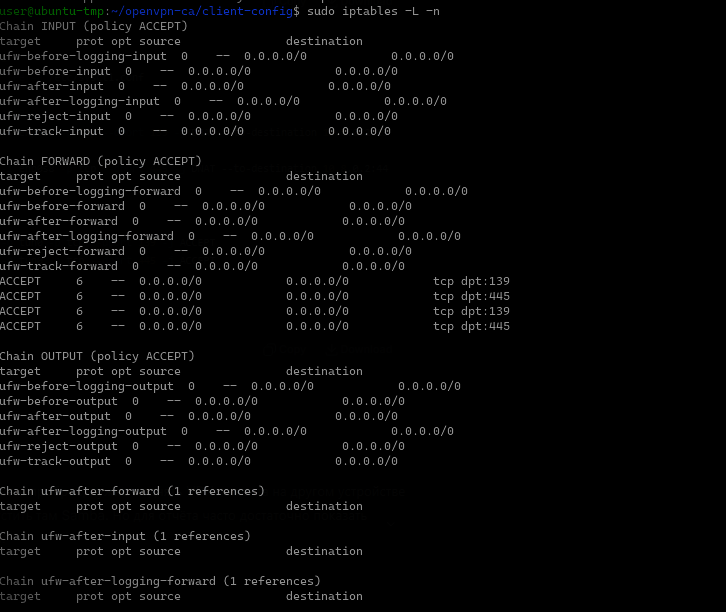
---

## 12. Выводы  
В ходе лабораторной работы были успешно настроены:  
- SSH-доступ по ключу, статическая сеть;  
- программный RAID 5 с возможностью горячего расширения;  
- LVM-том, смонтированный в `/raid/0`;  
- NFS-экспорт каталога backup;  
- автоматическое резервное копирование через cron;  
- правила фильтрации трафика с помощью iptables и UFW;  
- диагностические утилиты (ss, nc, tcpdump, iptraf-ng);  
- второй сетевой интерфейс с IP 172.23.0.7/24;  
- OpenVPN-сервер с подключением клиента;  
- Samba-сервер, доступный по сети;  
- проброс портов между сетями.  

**Трудности:**  
- начальная блокировка SSH при добавлении iptables-правила;  
- устаревший синтаксис easy-rsa в старых инструкциях (переход к easyrsa 3.x).  
